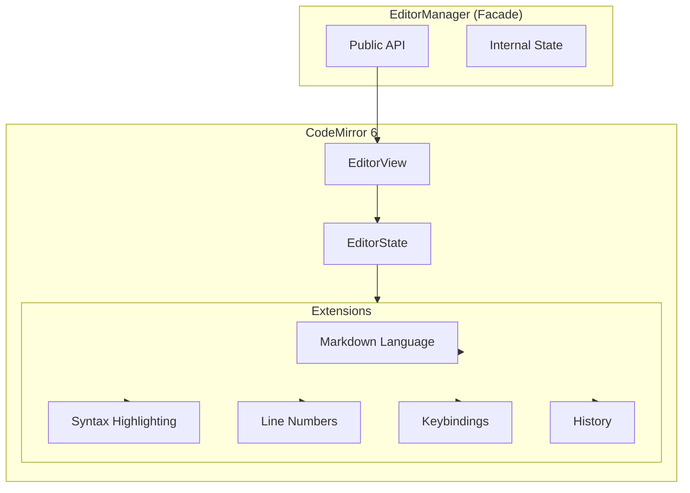
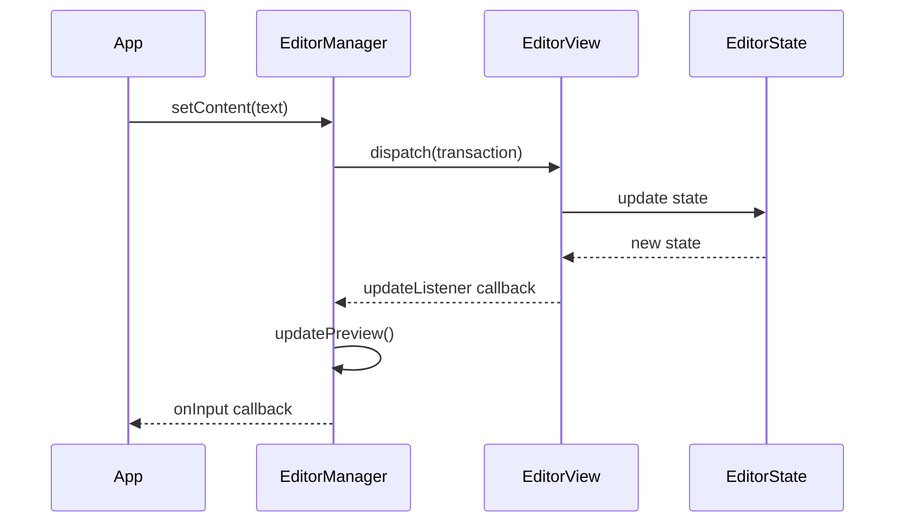

# Design Document: CodeMirror 6 Migration

## Overview

This design describes the migration of mded's editor from a plain `<textarea>` element to CodeMirror 6. The migration replaces the `EditorManager` class internals while preserving its public API, ensuring other components continue to work without modification.

CodeMirror 6 is a ground-up rewrite of the CodeMirror editor, featuring:
- Modular architecture with tree-shakeable packages
- Immutable state model with transactions
- Excellent TypeScript support
- Built-in accessibility features
- ~50KB bundle size (acceptable for desktop apps)

## Architecture



### Component Interaction Flow



## Components and Interfaces

### EditorManager Class

The `EditorManager` class maintains its existing public interface while internally using CodeMirror 6:

```typescript
export class EditorManager {
  // CodeMirror internals (private)
  private view: EditorView;
  private originalContent: string = '';
  
  // Existing DOM references
  private editorContainer: HTMLElement;
  private preview: HTMLDivElement;
  private modeLabel: HTMLSpanElement;
  
  // Existing public state
  public isPreviewMode = false;
  
  // Existing callbacks
  public onInput: (() => void) | null = null;
  public onSave: (() => void) | null = null;
  public onStatsUpdate: ((completed: number, total: number) => void) | null = null;

  // Font size state
  private fontSize: number = 16;

  constructor(
    editorContainer: HTMLElement,
    previewEl: HTMLDivElement,
    modeLabelEl: HTMLSpanElement
  );

  // Public API (unchanged signatures)
  getContent(): string;
  setContent(content: string): void;
  isContentChanged(): boolean;
  clear(): void;
  focus(): void;
  togglePreview(): void;
  updatePreview(): void;
  updateStats(): void;
  toggleCheckbox(index: number): void;
  changeFontSize(delta: number): void;
  insertMarkdown(before: string, after?: string): void;
  insertLineMarkdown(prefix: string): void;
  duplicateLine(): void;
  deleteCurrentLine(): void;
}
```

### CodeMirror Extensions Configuration

```typescript
interface EditorExtensions {
  // Core extensions
  basicSetup: Extension;        // Line numbers, bracket matching, etc.
  markdown: Extension;          // Markdown language support
  syntaxHighlighting: Extension; // Theme-aware highlighting
  history: Extension;           // Undo/redo with 100+ operations
  
  // Custom extensions
  updateListener: Extension;    // Triggers onInput callback
  customKeymap: Extension;      // Markdown shortcuts, list continuation
  autoPairing: Extension;       // Bracket/quote auto-close
}
```

### Required CodeMirror Packages

```json
{
  "@codemirror/state": "^6.x",
  "@codemirror/view": "^6.x",
  "@codemirror/language": "^6.x",
  "@codemirror/lang-markdown": "^6.x",
  "@codemirror/commands": "^6.x",
  "@codemirror/autocomplete": "^6.x",
  "codemirror": "^6.x"
}
```

## Data Models

### Editor State Model

CodeMirror 6 uses an immutable state model:

```typescript
interface EditorStateSnapshot {
  doc: Text;           // Document content as rope data structure
  selection: EditorSelection;  // Cursor position(s)
  // Extensions provide additional state facets
}
```

### Transaction Model

All changes go through transactions:

```typescript
interface TransactionSpec {
  changes?: ChangeSpec;      // Document modifications
  selection?: EditorSelection; // Cursor updates
  effects?: StateEffect[];   // Side effects
  annotations?: Annotation[]; // Metadata
}
```

### Content Serialization

Content is stored as plain text strings, same as current implementation:

```typescript
// Reading content
const content: string = view.state.doc.toString();

// Writing content
view.dispatch({
  changes: {
    from: 0,
    to: view.state.doc.length,
    insert: newContent
  }
});
```

## Correctness Properties

*A property is a characteristic or behavior that should hold true across all valid executions of a system-essentially, a formal statement about what the system should do. Properties serve as the bridge between human-readable specifications and machine-verifiable correctness guarantees.*

### Property 1: Content round-trip consistency
*For any* valid string content, setting content via `setContent()` and immediately retrieving it via `getContent()` SHALL return an identical string.
**Validates: Requirements 5.1, 5.2, 5.3, 6.1, 6.2**

### Property 2: Undo restores previous state
*For any* sequence of edit operations, performing an undo SHALL restore the document to its state before the most recent edit.
**Validates: Requirements 2.1, 2.4**

### Property 3: Redo restores undone state
*For any* undo operation, performing a redo SHALL restore the document to its state before the undo was performed.
**Validates: Requirements 2.2**

### Property 4: Content change detection accuracy
*For any* document state, `isContentChanged()` SHALL return true if and only if the current content differs from the content at the last `setContent()` call.
**Validates: Requirements 6.5**

### Property 5: Checkbox toggle correctness
*For any* document containing task list items, toggling checkbox at index N SHALL change only the Nth checkbox marker between `[ ]` and `[x]`, leaving all other content unchanged.
**Validates: Requirements 4.2**

### Property 6: Clear resets state completely
*For any* editor state, calling `clear()` SHALL result in empty content and `isContentChanged()` returning false.
**Validates: Requirements 6.4**

### Property 7: Line numbers match document lines
*For any* document content, the number of line numbers displayed SHALL equal the number of lines in the document.
**Validates: Requirements 3.1, 3.2**

### Property 8: Task statistics accuracy
*For any* document content, the task statistics (completed, total) SHALL accurately reflect the count of `- [x]`/`- [X]` and `- [ ]` patterns in the document.
**Validates: Requirements 6.7**

## Error Handling

### Initialization Errors

| Error Condition | Handling Strategy |
|----------------|-------------------|
| Container element not found | Throw descriptive error with element selector |
| CodeMirror fails to initialize | Log error, fall back to textarea if possible |
| Extension loading fails | Initialize with minimal extensions, log warning |

### Runtime Errors

| Error Condition | Handling Strategy |
|----------------|-------------------|
| Invalid transaction | Reject transaction, maintain current state |
| Content too large | Warn user, proceed with potential performance degradation |
| Paste handler fails | Fall back to default paste behavior |
| Image save fails | Show error notification, don't insert markdown |

### State Recovery

```typescript
// If state becomes corrupted, reset to last known good state
private recoverState(): void {
  const content = this.originalContent;
  this.view.dispatch({
    changes: { from: 0, to: this.view.state.doc.length, insert: content }
  });
}
```

## Testing Strategy

### Property-Based Testing

The implementation will use **fast-check** for property-based testing in TypeScript/JavaScript.

Each property-based test MUST:
- Run a minimum of 100 iterations
- Be tagged with a comment referencing the correctness property: `**Feature: codemirror-migration, Property {number}: {property_text}**`
- Generate diverse inputs including edge cases (empty strings, unicode, very long content)

### Unit Tests

Unit tests will cover:
- Specific markdown formatting operations (bold, italic, headers)
- List continuation behavior with various list types
- Auto-pairing for all bracket/quote types
- Preview mode toggle state transitions
- Font size change boundaries

### Integration Points

- Verify `onInput` callback fires on content changes
- Verify `onStatsUpdate` callback fires with correct counts
- Verify preview HTML updates match source markdown
- Verify keyboard shortcuts trigger correct operations

### Test Environment

Tests will use jsdom to simulate DOM environment for CodeMirror initialization. The EditorManager will be instantiated with mock container elements.
