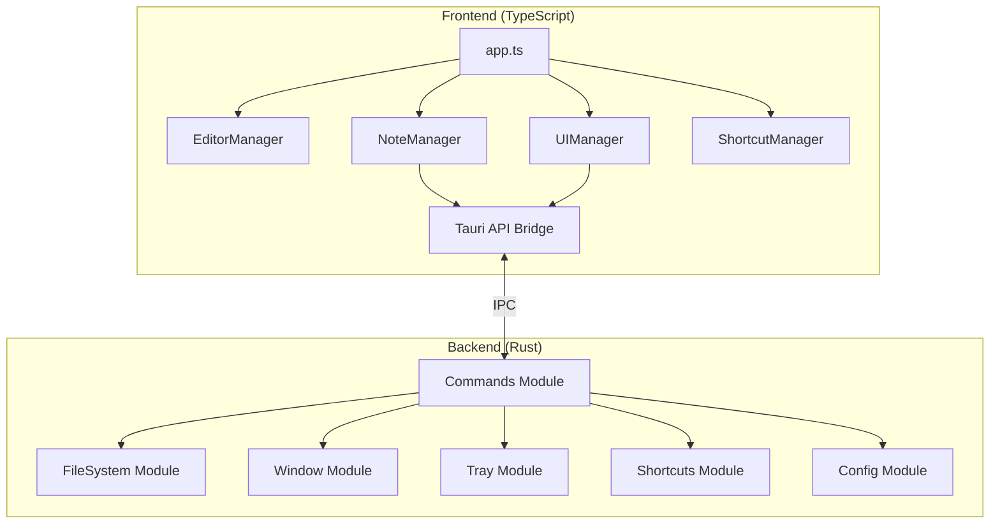

# Design Document: MDed Tauri 2.x Migration

## Overview

This design document describes the architecture and implementation approach for migrating MDed from Electron to Tauri 2.x. The migration preserves the existing TypeScript/vanilla DOM frontend while replacing the Node.js backend with Rust. The application maintains all existing features including frameless windows, system tray integration, global shortcuts, and the glassmorphism UI design.

## Architecture

The application follows a clear separation between the Rust backend and TypeScript frontend, communicating via Tauri's IPC mechanism.




## Components and Interfaces

### Rust Backend Modules

#### 1. Commands Module (`src-tauri/src/commands/`)

The commands module exposes all IPC handlers to the frontend. Each command is a Tauri command function decorated with `#[tauri::command]`.

```rust
// Folder Operations
#[tauri::command]
async fn list_folders(state: State<'_, AppState>) -> Result<Vec<FolderInfo>, String>;

#[tauri::command]
async fn create_folder(name: String, state: State<'_, AppState>) -> Result<ApiResult, String>;

#[tauri::command]
async fn delete_folder(name: String, state: State<'_, AppState>) -> Result<ApiResult, String>;

#[tauri::command]
async fn rename_folder(old_name: String, new_name: String, state: State<'_, AppState>) -> Result<ApiResult, String>;

// Note Operations
#[tauri::command]
async fn list_notes(folder: Option<String>, state: State<'_, AppState>) -> Result<Vec<NoteInfo>, String>;

#[tauri::command]
async fn read_note(note_id: String, folder: Option<String>, state: State<'_, AppState>) -> Result<ApiResult, String>;

#[tauri::command]
async fn save_note(note_id: String, content: String, folder: Option<String>, state: State<'_, AppState>) -> Result<ApiResult, String>;

#[tauri::command]
async fn create_note(folder: Option<String>, state: State<'_, AppState>) -> Result<ApiResult, String>;

#[tauri::command]
async fn delete_note(note_id: String, folder: Option<String>, state: State<'_, AppState>) -> Result<ApiResult, String>;

#[tauri::command]
async fn rename_note(note_id: String, new_name: String, folder: Option<String>, state: State<'_, AppState>) -> Result<ApiResult, String>;

#[tauri::command]
async fn move_note(note_id: String, from_folder: String, to_folder: String, state: State<'_, AppState>) -> Result<ApiResult, String>;

#[tauri::command]
async fn toggle_pin_note(note_id: String, state: State<'_, AppState>) -> Result<ApiResult, String>;

// Note Order
#[tauri::command]
async fn get_note_order(state: State<'_, AppState>) -> Result<HashMap<String, Vec<String>>, String>;

#[tauri::command]
async fn save_note_order(order: HashMap<String, Vec<String>>, state: State<'_, AppState>) -> Result<ApiResult, String>;

// Window Controls
#[tauri::command]
async fn minimize_window(window: Window) -> Result<(), String>;

#[tauri::command]
async fn maximize_window(window: Window) -> Result<(), String>;

#[tauri::command]
async fn close_window(window: Window) -> Result<(), String>;

#[tauri::command]
async fn set_always_on_top(flag: bool, window: Window) -> Result<ApiResult, String>;

#[tauri::command]
async fn enter_minimal_mode(window: Window, state: State<'_, AppState>) -> Result<ApiResult, String>;

#[tauri::command]
async fn exit_minimal_mode(window: Window, state: State<'_, AppState>) -> Result<ApiResult, String>;

#[tauri::command]
async fn save_minimal_bounds(window: Window, state: State<'_, AppState>) -> Result<ApiResult, String>;

#[tauri::command]
async fn get_window_opacity(state: State<'_, AppState>) -> Result<f64, String>;

#[tauri::command]
async fn set_window_opacity(opacity: f64, window: Window, state: State<'_, AppState>) -> Result<ApiResult, String>;

#[tauri::command]
async fn get_display_info(window: Window) -> Result<DisplayInfo, String>;

// System Integration
#[tauri::command]
async fn save_screenshot(base64_data: String, state: State<'_, AppState>) -> Result<ApiResult, String>;

#[tauri::command]
async fn get_assets_path(state: State<'_, AppState>) -> Result<String, String>;

#[tauri::command]
async fn read_external_file(file_path: String) -> Result<ApiResult, String>;

#[tauri::command]
async fn get_auto_start(app: AppHandle) -> Result<bool, String>;

#[tauri::command]
async fn set_auto_start(enabled: bool, app: AppHandle) -> Result<ApiResult, String>;

// Config
#[tauri::command]
async fn get_global_shortcut(state: State<'_, AppState>) -> Result<String, String>;

#[tauri::command]
async fn set_global_shortcut(key: String, app: AppHandle, state: State<'_, AppState>) -> Result<ApiResult, String>;

#[tauri::command]
async fn get_last_note(state: State<'_, AppState>) -> Result<LastNote, String>;

#[tauri::command]
async fn save_last_note(note_id: Option<String>, folder: Option<String>, state: State<'_, AppState>) -> Result<ApiResult, String>;

#[tauri::command]
async fn save_quick_note(content: String, state: State<'_, AppState>, app: AppHandle) -> Result<ApiResult, String>;
```


#### 2. FileSystem Module (`src-tauri/src/filesystem.rs`)

Handles all file operations with path validation for security.

```rust
pub struct FileSystem {
    notes_dir: PathBuf,
    assets_dir: PathBuf,
    config_file: PathBuf,
    order_file: PathBuf,
}

impl FileSystem {
    pub fn new() -> Result<Self, String>;
    pub fn validate_path(&self, base_dir: &Path, relative_path: &str) -> Result<PathBuf, String>;
    pub fn ensure_directories(&self) -> Result<(), String>;
    pub fn list_folders(&self) -> Result<Vec<FolderInfo>, String>;
    pub fn create_folder(&self, name: &str) -> Result<(), String>;
    pub fn delete_folder(&self, name: &str) -> Result<(), String>;
    pub fn rename_folder(&self, old_name: &str, new_name: &str) -> Result<(), String>;
    pub fn list_notes(&self, folder: Option<&str>) -> Result<Vec<NoteInfo>, String>;
    pub fn read_note(&self, note_id: &str, folder: Option<&str>) -> Result<String, String>;
    pub fn save_note(&self, note_id: &str, content: &str, folder: Option<&str>) -> Result<(), String>;
    pub fn create_note(&self, folder: Option<&str>) -> Result<(String, String), String>;
    pub fn delete_note(&self, note_id: &str, folder: Option<&str>) -> Result<(), String>;
    pub fn rename_note(&self, note_id: &str, new_name: &str, folder: Option<&str>) -> Result<String, String>;
    pub fn move_note(&self, note_id: &str, from_folder: &str, to_folder: &str) -> Result<(), String>;
    pub fn save_screenshot(&self, base64_data: &str) -> Result<(String, String), String>;
}
```

#### 3. Config Module (`src-tauri/src/config.rs`)

Manages application configuration with debounced persistence.

```rust
#[derive(Serialize, Deserialize, Clone)]
pub struct Config {
    pub global_shortcut: String,
    pub clipboard_shortcut: String,
    pub quick_note_shortcut: String,
    pub window_bounds: WindowBounds,
    pub last_note_id: Option<String>,
    pub last_folder: Option<String>,
    pub pinned_notes: Vec<String>,
    pub minimal_mode_bounds: WindowBounds,
    pub window_opacity: f64,
    pub auto_start_on_boot: bool,
}

impl Default for Config {
    fn default() -> Self {
        Self {
            global_shortcut: "CommandOrControl+Shift+N".to_string(),
            clipboard_shortcut: "CommandOrControl+Alt+V".to_string(),
            quick_note_shortcut: "CommandOrControl+Alt+N".to_string(),
            window_bounds: WindowBounds { width: 1200, height: 800, x: None, y: None },
            last_note_id: None,
            last_folder: None,
            pinned_notes: vec![],
            minimal_mode_bounds: WindowBounds { width: 400, height: 300, x: None, y: None },
            window_opacity: 1.0,
            auto_start_on_boot: false,
        }
    }
}

pub struct ConfigManager {
    config: RwLock<Config>,
    config_path: PathBuf,
    save_timer: Mutex<Option<JoinHandle<()>>>,
}

impl ConfigManager {
    pub fn new(config_path: PathBuf) -> Result<Self, String>;
    pub fn load(&self) -> Result<(), String>;
    pub fn get(&self) -> Config;
    pub fn update<F>(&self, f: F) where F: FnOnce(&mut Config);
    pub fn schedule_save(&self);
    fn save(&self) -> Result<(), String>;
}
```

#### 4. Window Module (`src-tauri/src/window.rs`)

Manages window state and operations.

```rust
pub struct WindowManager {
    normal_bounds: Mutex<Option<WindowBounds>>,
    is_minimal_mode: AtomicBool,
}

impl WindowManager {
    pub fn new() -> Self;
    pub fn enter_minimal_mode(&self, window: &Window, config: &Config) -> Result<(), String>;
    pub fn exit_minimal_mode(&self, window: &Window) -> Result<WindowBounds, String>;
    pub fn save_minimal_bounds(&self, window: &Window) -> Result<WindowBounds, String>;
    pub fn is_in_minimal_mode(&self) -> bool;
    pub fn set_opacity(&self, window: &Window, opacity: f64) -> Result<f64, String>;
}
```


#### 5. Shortcuts Module (`src-tauri/src/shortcuts.rs`)

Manages global keyboard shortcuts using Tauri's global shortcut plugin.

```rust
pub struct ShortcutManager {
    registered_shortcuts: Mutex<HashMap<String, String>>,
}

impl ShortcutManager {
    pub fn new() -> Self;
    pub fn register_toggle_shortcut(&self, app: &AppHandle, key: &str) -> Result<(), String>;
    pub fn register_clipboard_shortcut(&self, app: &AppHandle, key: &str) -> Result<(), String>;
    pub fn register_quick_note_shortcut(&self, app: &AppHandle, key: &str) -> Result<(), String>;
    pub fn unregister_all(&self, app: &AppHandle);
}
```

#### 6. Tray Module (`src-tauri/src/tray.rs`)

Manages system tray icon and menu.

```rust
pub fn setup_tray(app: &AppHandle) -> Result<(), String>;
pub fn handle_tray_event(app: &AppHandle, event: SystemTrayEvent);
```

### Frontend TypeScript Modules

#### API Bridge (`src/renderer/api.ts`)

New module that wraps Tauri's invoke API to match the existing `window.electron` interface.

```typescript
import { invoke } from '@tauri-apps/api/core';
import { listen } from '@tauri-apps/api/event';
import { getCurrentWindow } from '@tauri-apps/api/window';

export const tauriAPI = {
  // Folder operations
  listFolders: () => invoke<FolderInfo[]>('list_folders'),
  createFolder: (name: string) => invoke<ApiResult>('create_folder', { name }),
  deleteFolder: (name: string) => invoke<ApiResult>('delete_folder', { name }),
  renameFolder: (oldName: string, newName: string) => invoke<ApiResult>('rename_folder', { oldName, newName }),
  
  // Note operations
  listNotes: (folder?: string) => invoke<NoteInfo[]>('list_notes', { folder }),
  readNote: (noteId: string, folder?: string) => invoke<ApiResult>('read_note', { noteId, folder }),
  saveNote: (noteId: string, content: string, folder?: string) => invoke<ApiResult>('save_note', { noteId, content, folder }),
  createNote: (folder?: string) => invoke<ApiResult>('create_note', { folder }),
  deleteNote: (noteId: string, folder?: string) => invoke<ApiResult>('delete_note', { noteId, folder }),
  renameNote: (noteId: string, newName: string, folder?: string) => invoke<ApiResult>('rename_note', { noteId, newName, folder }),
  moveNoteToFolder: (noteId: string, currentFolder: string, targetFolder: string) => 
    invoke<ApiResult>('move_note', { noteId, fromFolder: currentFolder, toFolder: targetFolder }),
  togglePinNote: (noteId: string) => invoke<ApiResult>('toggle_pin_note', { noteId }),
  
  // Note order
  getNoteOrder: () => invoke<Record<string, string[]>>('get_note_order'),
  saveNoteOrder: (order: Record<string, string[]>) => invoke<ApiResult>('save_note_order', { order }),
  
  // Window controls
  minimizeWindow: () => getCurrentWindow().minimize(),
  maximizeWindow: async () => {
    const win = getCurrentWindow();
    if (await win.isMaximized()) {
      await win.unmaximize();
    } else {
      await win.maximize();
    }
  },
  closeWindow: () => getCurrentWindow().hide(),
  setAlwaysOnTop: (flag: boolean) => invoke<ApiResult>('set_always_on_top', { flag }),
  
  // Minimal mode
  enterMinimalMode: () => invoke<ApiResult>('enter_minimal_mode'),
  exitMinimalMode: () => invoke<ApiResult>('exit_minimal_mode'),
  saveMinimalBounds: () => invoke<ApiResult>('save_minimal_bounds'),
  
  // Display
  getWindowOpacity: () => invoke<number>('get_window_opacity'),
  setWindowOpacity: (opacity: number) => invoke<ApiResult>('set_window_opacity', { opacity }),
  getDisplayInfo: () => invoke<DisplayInfo>('get_display_info'),
  
  // System integration
  saveScreenshot: (base64Data: string) => invoke<ApiResult>('save_screenshot', { base64Data }),
  getAssetsPath: () => invoke<string>('get_assets_path'),
  readExternalFile: (filePath: string) => invoke<ApiResult>('read_external_file', { filePath }),
  getAutoStart: () => invoke<boolean>('get_auto_start'),
  setAutoStart: (enabled: boolean) => invoke<ApiResult>('set_auto_start', { enabled }),
  
  // Config
  getGlobalShortcut: () => invoke<string>('get_global_shortcut'),
  setGlobalShortcut: (key: string) => invoke<ApiResult>('set_global_shortcut', { key }),
  getLastNote: () => invoke<{ noteId: string | null, folder: string | null }>('get_last_note'),
  saveLastNote: (noteId: string | null, folder: string | null) => invoke<ApiResult>('save_last_note', { noteId, folder }),
  saveQuickNote: (content: string) => invoke<ApiResult>('save_quick_note', { content }),
  
  // Events
  onRefreshNotes: (callback: (noteId?: string) => void) => {
    return listen<string>('refresh-notes', (event) => callback(event.payload));
  },
  onOpenFile: (callback: (filePath: string) => void) => {
    return listen<string>('open-file', (event) => callback(event.payload));
  }
};

// Expose as window.electron for compatibility
(window as any).electron = tauriAPI;
```


## Data Models

### Rust Data Structures

```rust
#[derive(Serialize, Deserialize, Clone)]
pub struct FolderInfo {
    pub name: String,
    pub path: String,
}

#[derive(Serialize, Deserialize, Clone)]
pub struct NoteInfo {
    pub id: String,
    pub title: String,
    pub modified: DateTime<Utc>,
    pub created: DateTime<Utc>,
    pub folder: String,
    pub pinned: bool,
}

#[derive(Serialize, Deserialize, Clone)]
pub struct ApiResult {
    pub success: bool,
    #[serde(skip_serializing_if = "Option::is_none")]
    pub error: Option<String>,
    #[serde(skip_serializing_if = "Option::is_none")]
    pub content: Option<String>,
    #[serde(skip_serializing_if = "Option::is_none")]
    pub note_id: Option<String>,
    #[serde(skip_serializing_if = "Option::is_none")]
    pub folder: Option<String>,
    #[serde(skip_serializing_if = "Option::is_none")]
    pub image_path: Option<String>,
    #[serde(skip_serializing_if = "Option::is_none")]
    pub image_id: Option<String>,
    #[serde(skip_serializing_if = "Option::is_none")]
    pub file_name: Option<String>,
    #[serde(skip_serializing_if = "Option::is_none")]
    pub file_path: Option<String>,
    #[serde(skip_serializing_if = "Option::is_none")]
    pub pinned: Option<bool>,
    #[serde(skip_serializing_if = "Option::is_none")]
    pub opacity: Option<f64>,
}

#[derive(Serialize, Deserialize, Clone)]
pub struct WindowBounds {
    pub width: u32,
    pub height: u32,
    pub x: Option<i32>,
    pub y: Option<i32>,
}

#[derive(Serialize, Deserialize, Clone)]
pub struct DisplayInfo {
    pub x: i32,
    pub y: i32,
    pub width: u32,
    pub height: u32,
}

#[derive(Serialize, Deserialize, Clone)]
pub struct LastNote {
    pub note_id: Option<String>,
    pub folder: Option<String>,
}
```

### Application State

```rust
pub struct AppState {
    pub config: ConfigManager,
    pub filesystem: FileSystem,
    pub window_manager: WindowManager,
    pub shortcut_manager: ShortcutManager,
}
```

## Correctness Properties

*A property is a characteristic or behavior that should hold true across all valid executions of a system-essentially, a formal statement about what the system should do. Properties serve as the bridge between human-readable specifications and machine-verifiable correctness guarantees.*

### Property 1: Note Content Round-Trip

*For any* valid note content string, saving the content to a note and then reading it back should return the exact same content.

**Validates: Requirements 11.3, 11.4**

### Property 2: Note Order Round-Trip

*For any* valid note ordering (map of folder to note ID arrays), saving the order and then retrieving it should return the exact same ordering.

**Validates: Requirements 12.2, 12.3**

### Property 3: Window Bounds Persistence Round-Trip

*For any* valid window bounds (width, height, x, y), persisting the bounds to configuration and then loading should return the same bounds.

**Validates: Requirements 2.3, 2.4**

### Property 4: Opacity Persistence Round-Trip

*For any* opacity value between 0.3 and 1.0, setting the opacity and then retrieving it should return the same value (after clamping).

**Validates: Requirements 6.2, 6.3**

### Property 5: Path Traversal Rejection

*For any* path string containing "..", "/" or "\\" characters, the path validator should reject it with an error.

**Validates: Requirements 13.1, 13.2, 13.3**

### Property 6: Minimum Window Size Enforcement

*For any* window resize operation that would result in dimensions below 300x200, the window should remain at or above the minimum size.

**Validates: Requirements 2.2**

### Property 7: Opacity Clamping

*For any* opacity value, setting it should result in a value clamped between 0.3 and 1.0.

**Validates: Requirements 6.1**

### Property 8: Pinned Notes Ordering

*For any* list of notes with mixed pinned/unpinned status, listing notes should return all pinned notes before any unpinned notes.

**Validates: Requirements 12.4**

### Property 9: Folder Listing Includes Virtual Folder

*For any* state of the notes directory, listing folders should always include "All Notes" as the first entry.

**Validates: Requirements 10.1**

### Property 10: Note Creation Generates UUID

*For any* note creation operation, the generated note ID should match the UUID format pattern `note-{uuid}.md`.

**Validates: Requirements 11.5**

### Property 11: Folder Deletion Removes All Contents

*For any* folder containing notes, deleting the folder should result in all contained notes being removed.

**Validates: Requirements 10.3**

### Property 12: Note Move Preserves Content

*For any* note with content, moving it from one folder to another should preserve the exact content.

**Validates: Requirements 11.8**

### Property 13: Pin Toggle Idempotence

*For any* note, toggling pin status twice should return the note to its original pinned state.

**Validates: Requirements 12.1**

### Property 14: External File Extension Validation

*For any* file path not ending in ".md", the external file reader should reject it with an error.

**Validates: Requirements 15.1**

### Property 15: Screenshot Save Returns Valid Path

*For any* valid base64 PNG image data, saving it should return a path that exists in the assets directory.

**Validates: Requirements 14.1, 14.2**

### Property 16: Config Merge Preserves Defaults

*For any* partial configuration file, loading should result in a config where missing fields have default values.

**Validates: Requirements 17.2**

### Property 17: Minimal Mode Bounds Isolation

*For any* window resize in minimal mode, the saved bounds should not affect normal mode bounds.

**Validates: Requirements 5.3**


## Error Handling

### Rust Error Strategy

All commands return `Result<T, String>` where the error string contains a user-friendly message. Internal errors are logged but not exposed to the frontend.

```rust
// Error conversion helper
fn to_user_error<E: std::fmt::Display>(context: &str, err: E) -> String {
    log::error!("{}: {}", context, err);
    format!("{}: {}", context, err)
}

// Usage in commands
#[tauri::command]
async fn read_note(note_id: String, folder: Option<String>, state: State<'_, AppState>) -> Result<ApiResult, String> {
    state.filesystem.read_note(&note_id, folder.as_deref())
        .map(|content| ApiResult { success: true, content: Some(content), ..Default::default() })
        .map_err(|e| to_user_error("Failed to read note", e))
}
```

### Frontend Error Handling

The frontend displays errors via toast notifications and handles specific error cases:

```typescript
// In note-manager.ts
async readNote(id: string, folder: string): Promise<ApiResult> {
    try {
        return await window.electron.readNote(id, folder || undefined);
    } catch (error) {
        return { success: false, error: String(error) };
    }
}

// In app.ts - handling ENOENT errors
if (result.error && (result.error.includes('ENOENT') || result.error.includes('no such file'))) {
    ui.showToast('Note not found', 'error');
    // Handle missing note...
}
```

## Testing Strategy

### Dual Testing Approach

The implementation uses both unit tests and property-based tests:

1. **Unit Tests**: Verify specific examples and edge cases
2. **Property-Based Tests**: Verify universal properties across random inputs

### Property-Based Testing Framework

Use `proptest` crate for Rust property-based testing with minimum 100 iterations per property.

```rust
// In Cargo.toml
[dev-dependencies]
proptest = "1.4"
tempfile = "3.10"

// Example property test
use proptest::prelude::*;

proptest! {
    #![proptest_config(ProptestConfig::with_cases(100))]
    
    // **Feature: mded-tauri-migration, Property 1: Note Content Round-Trip**
    #[test]
    fn prop_note_content_round_trip(content in ".*") {
        let temp_dir = tempfile::tempdir().unwrap();
        let fs = FileSystem::new_with_base(temp_dir.path()).unwrap();
        
        let (note_id, _) = fs.create_note(None).unwrap();
        fs.save_note(&note_id, &content, None).unwrap();
        let read_content = fs.read_note(&note_id, None).unwrap();
        
        prop_assert_eq!(content, read_content);
    }
}
```

### Unit Test Examples

```rust
#[cfg(test)]
mod tests {
    use super::*;
    
    #[test]
    fn test_path_validation_rejects_traversal() {
        let fs = FileSystem::new().unwrap();
        assert!(fs.validate_path(&fs.notes_dir, "../etc/passwd").is_err());
        assert!(fs.validate_path(&fs.notes_dir, "folder/../../../etc").is_err());
    }
    
    #[test]
    fn test_path_validation_rejects_separators() {
        let fs = FileSystem::new().unwrap();
        assert!(fs.validate_path(&fs.notes_dir, "folder/note.md").is_err());
        assert!(fs.validate_path(&fs.notes_dir, "folder\\note.md").is_err());
    }
    
    #[test]
    fn test_opacity_clamping() {
        let wm = WindowManager::new();
        // Test values below minimum
        assert_eq!(wm.clamp_opacity(0.1), 0.3);
        assert_eq!(wm.clamp_opacity(0.0), 0.3);
        // Test values above maximum
        assert_eq!(wm.clamp_opacity(1.5), 1.0);
        // Test valid values
        assert_eq!(wm.clamp_opacity(0.5), 0.5);
    }
}
```

### Frontend Testing

Use Vitest for TypeScript unit tests:

```typescript
// api.test.ts
import { describe, it, expect, vi } from 'vitest';

describe('API Bridge', () => {
    it('should expose electron-compatible interface', () => {
        expect(window.electron).toBeDefined();
        expect(typeof window.electron.listFolders).toBe('function');
        expect(typeof window.electron.readNote).toBe('function');
    });
});
```

## Project Structure

```
mded-tauri/
├── src-tauri/
│   ├── Cargo.toml
│   ├── tauri.conf.json
│   ├── capabilities/
│   │   └── default.json
│   ├── icons/
│   │   └── icon.png
│   └── src/
│       ├── main.rs
│       ├── lib.rs
│       ├── commands/
│       │   ├── mod.rs
│       │   ├── folders.rs
│       │   ├── notes.rs
│       │   ├── window.rs
│       │   ├── config.rs
│       │   └── system.rs
│       ├── filesystem.rs
│       ├── config.rs
│       ├── window.rs
│       ├── shortcuts.rs
│       └── tray.rs
├── src/
│   └── renderer/
│       ├── api.ts          # New Tauri API bridge
│       ├── app.ts          # Preserved from Electron
│       ├── quick-note.ts   # Preserved from Electron
│       ├── types.ts        # Preserved from Electron
│       ├── global.d.ts     # Updated for Tauri
│       └── managers/       # Preserved from Electron
│           ├── editor-manager.ts
│           ├── note-manager.ts
│           ├── ui-manager.ts
│           └── shortcut-manager.ts
├── index.html              # Preserved from Electron
├── quick-note.html         # Preserved from Electron
├── styles.css              # Preserved from Electron
├── build/
│   └── atom-one-dark.min.css
├── package.json
├── pnpm-lock.yaml
├── tsconfig.json
└── vite.config.ts
```

## Tauri Configuration

```json
// tauri.conf.json
{
  "$schema": "https://schema.tauri.app/config/2",
  "productName": "MDed",
  "version": "2.0.0",
  "identifier": "com.mded.app",
  "build": {
    "beforeBuildCommand": "pnpm build",
    "beforeDevCommand": "pnpm dev",
    "devUrl": "http://localhost:5173",
    "frontendDist": "../dist"
  },
  "app": {
    "windows": [
      {
        "title": "MDed",
        "width": 1200,
        "height": 800,
        "minWidth": 300,
        "minHeight": 200,
        "decorations": false,
        "transparent": true,
        "resizable": true,
        "center": true
      }
    ],
    "security": {
      "csp": null
    },
    "trayIcon": {
      "iconPath": "icons/icon.png",
      "iconAsTemplate": true
    }
  },
  "bundle": {
    "active": true,
    "targets": "all",
    "icon": ["icons/icon.png"],
    "windows": {
      "nsis": {
        "oneClick": false,
        "allowToChangeInstallationDirectory": true
      }
    },
    "macOS": {
      "minimumSystemVersion": "10.13"
    },
    "linux": {
      "desktop": {
        "categories": ["Utility", "TextEditor"]
      }
    }
  },
  "plugins": {
    "autostart": {
      "macOSLaunchAgent": true
    },
    "global-shortcut": {},
    "notification": {},
    "clipboard-manager": {},
    "single-instance": {}
  }
}
```
